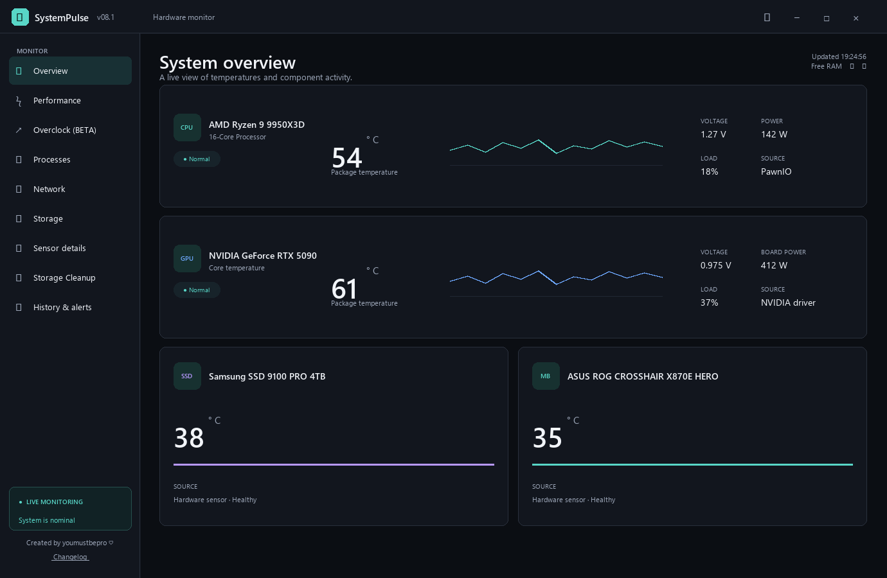
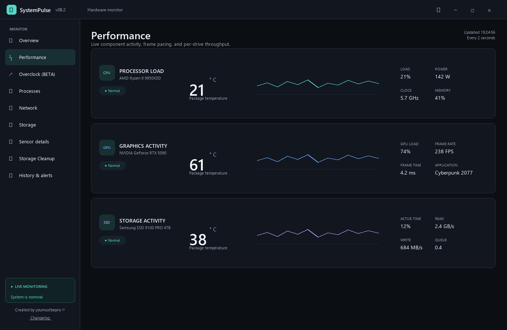
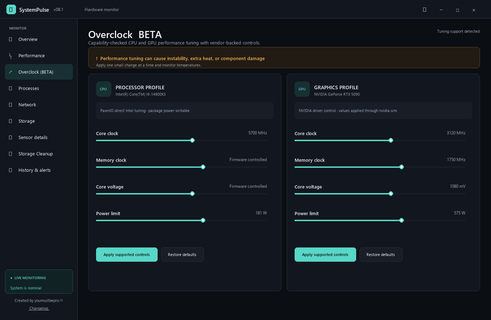
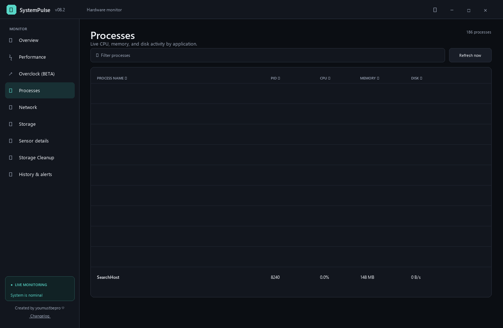
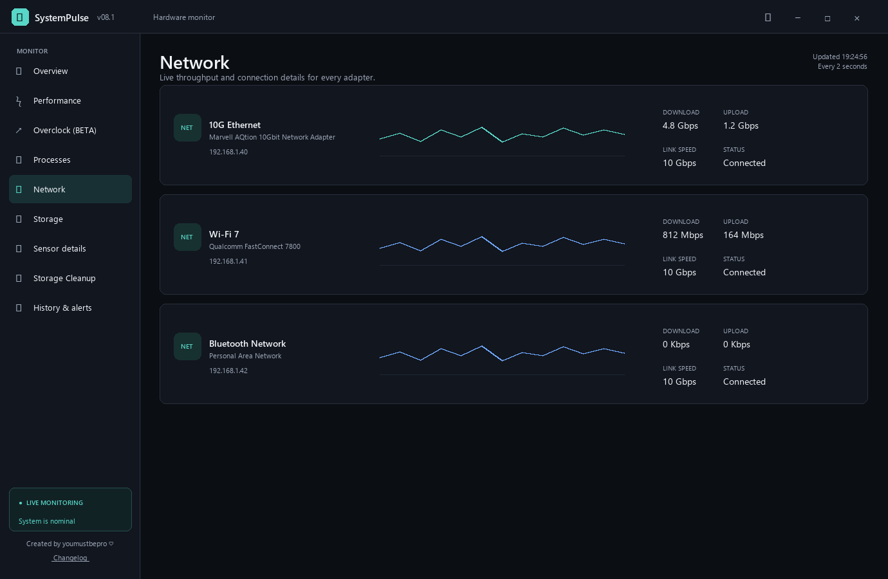
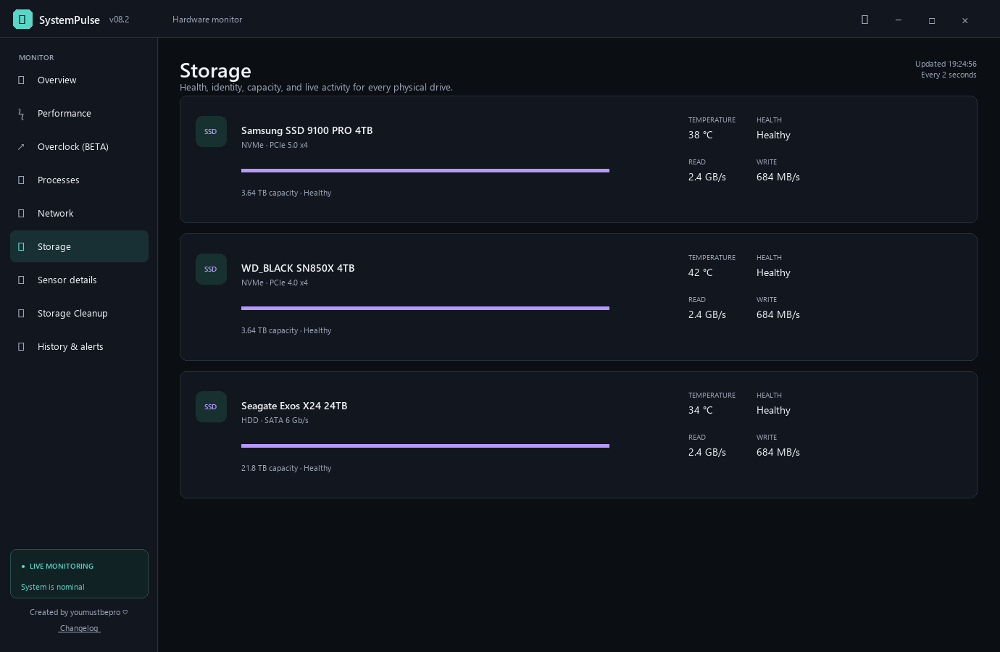
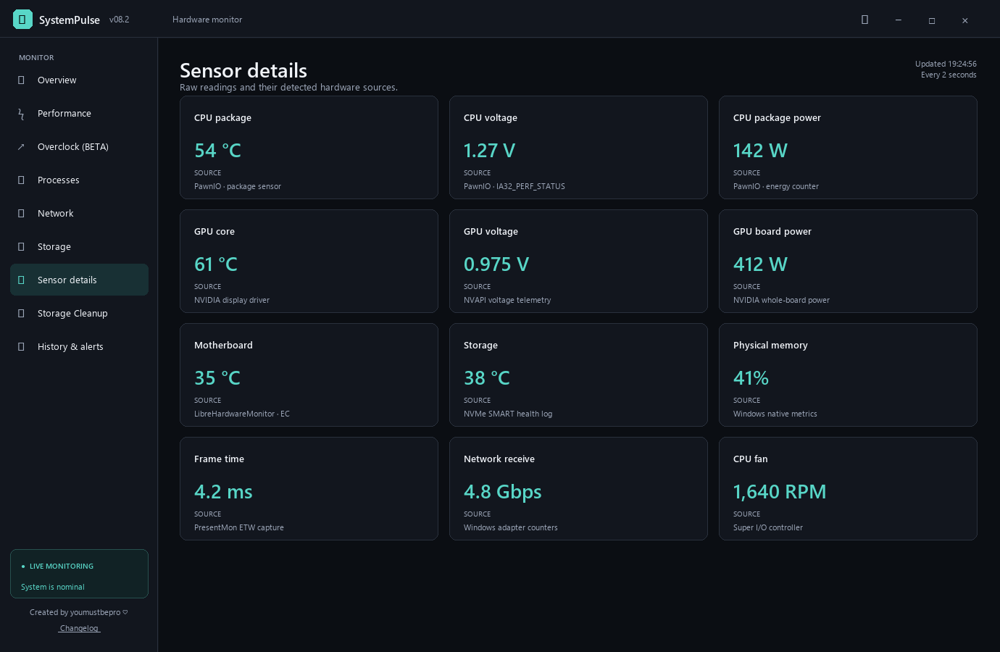
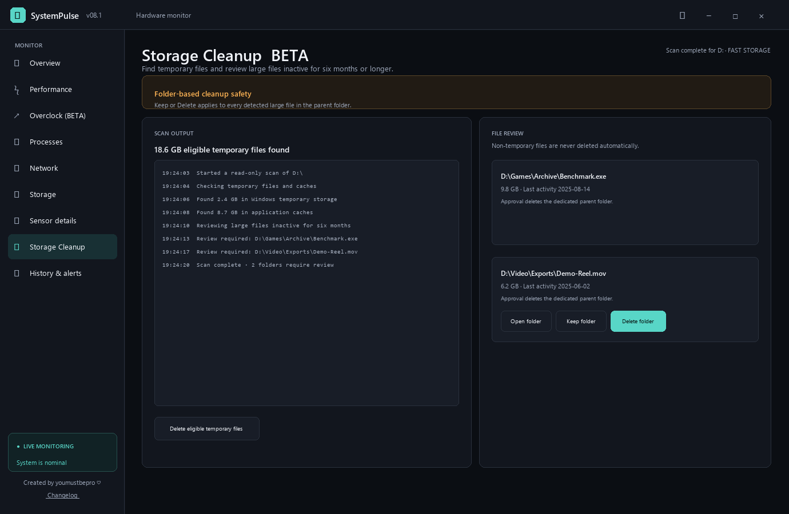
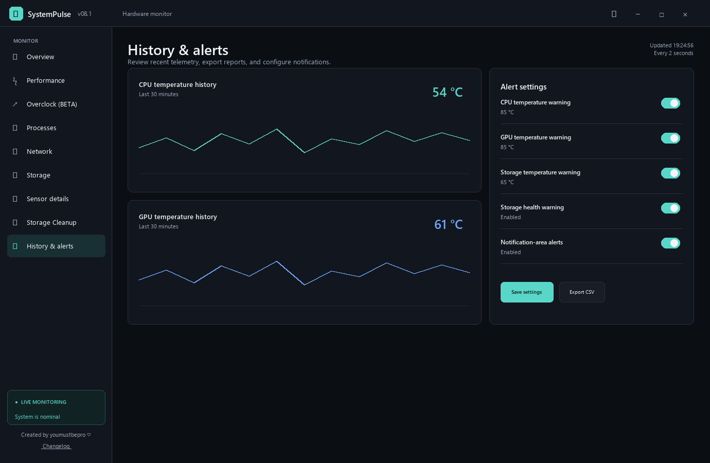

# SystemPulse

SystemPulse is a simple Windows 11 hardware monitor. It shows temperatures, usage, power, storage health, running processes, network activity, alerts, and cleanup tools in one window.

**Current version: v08.1**

> [!IMPORTANT]
> SystemPulse asks for administrator permission when it starts. This is required so the bundled PawnIO driver can read supported CPU sensors. PawnIO is installed automatically on the first launch.

## Download and start

1. Open the [SystemPulse Releases page](https://github.com/umustbepro/SystemPulse/releases).
2. Open the newest release.
3. Download `SystemPulse.exe`.
4. Run the downloaded file and approve the Windows administrator prompt.
5. If PawnIO requests a restart during the first launch, restart Windows once and open SystemPulse again.

The normal release is a single self-contained EXE. Users do **not** need to install .NET separately.

## What every page does

The screenshots below use fictional high-end components. Sensor availability still depends on the hardware and drivers installed in the computer.

### Overview



Overview is the quickest way to check the computer:

- CPU, GPU, storage, and motherboard temperatures
- CPU and GPU voltage, power, and current load when supported
- Live activity graphs and simple Normal/Warning status labels
- Storage model, type, capacity, and health
- **Free RAM** asks Windows and noncritical applications to release reclaimable working memory. It does not close applications or delete files.

### Performance



Performance shows what the computer is doing right now:

- CPU and GPU load history
- GPU frame rate and frame time for the actively presenting game or application
- Physical-drive activity, read speed, and write speed
- CPU and GPU power information where the hardware exposes it

Frame information comes from the bundled PresentMon capture engine. If no 3D application is presenting frames, FPS is shown as unavailable instead of being estimated.

### Overclock (Beta)



Overclock provides capability-checked tuning controls:

- Supported NVIDIA GPU clock and power controls are applied through the installed NVIDIA driver.
- Supported Intel package-power controls are applied directly through PawnIO.
- CPU ratio, voltage, memory, or GPU controls remain disabled when the processor, motherboard firmware, chipset, signed PawnIO module, or display driver does not allow them.
- **Restore defaults/baseline** returns supported settings to the values captured before tuning.

> [!WARNING]
> Overclocking can cause crashes, additional heat, data loss, or hardware damage. Increase values gradually and monitor temperatures. An unlocked Intel CPU still requires a compatible motherboard and firmware for multiplier overclocking.

### Processes



Processes explains which applications are using the system:

- Use the search box to filter by process name.
- Click **Process name**, **PID**, **CPU**, **Memory**, or **Disk** to sort that column.
- Click the same column again to switch between lowest-first and highest-first.
- Values refresh automatically while the page is open.

### Network



Network shows every detected adapter, including Ethernet and Wi-Fi:

- Adapter name and connection status
- Local address and negotiated link speed
- Current download and upload rates
- Total transmitted and received data

Disconnected or virtual adapters may appear with zero traffic.

### Storage



Storage creates one health card for every physical drive:

- Model, serial number, firmware, interface, and capacity
- Temperature and operational state
- SSD remaining life or wear information when reported
- Power-on hours and hardware error counters when available
- Live read, write, and active-time information

Some USB and RAID adapters block direct SMART information. SystemPulse keeps those drives visible and labels unavailable values honestly.

### Sensor details



Sensor details lists individual readings and tells the user where each value came from. Depending on the computer, sources can include PawnIO, the NVIDIA or AMD display driver, LibreHardwareMonitor, NVMe SMART, Windows performance counters, and PresentMon.

An unavailable reading means the hardware or driver did not expose a trustworthy value. SystemPulse does not invent missing temperatures or voltages.

### Storage Cleanup (Beta)



Storage Cleanup has two separate stages:

1. A read-only scan looks for eligible temporary files and large files that have been inactive for at least six months.
2. The user decides what should be removed.

Important cleanup behavior:

- Temporary files are removed only after clicking the cleanup button.
- Non-temporary large files are never deleted automatically.
- **Open folder** opens the file's source location.
- Choosing **Keep** skips every detected large file in the same parent folder.
- Choosing **Delete** applies to the reviewed parent folder, so SystemPulse does not repeatedly ask about associated files.
- Desktop, Downloads, Documents, Pictures, Music, Videos, drive roots, Windows folders, program folders, and reparse-point folders are protected from recursive deletion.

Always review the displayed path before approving deletion.

### History & alerts



History & alerts provides:

- Recent temperature and activity history
- Configurable CPU, GPU, and storage warning limits
- Storage-health notifications
- Notification-area alerts with cooldown protection
- Adjustable history retention
- CSV export for reports or troubleshooting

History is saved every ten seconds according to the selected retention setting.

## Automatic updates

SystemPulse checks [this repository's Releases page](https://github.com/umustbepro/SystemPulse/releases) when it starts and every 120 seconds afterward.

- The top-right update icon rotates slowly during normal checks.
- A larger blue dot alternates with the icon when a newer release is available.
- Clicking the icon downloads only the newest `SystemPulse.exe`.
- SystemPulse closes the matching running instance, replaces the current EXE, restarts it, and removes the temporary updater automatically.
- A release-provided SHA-256 digest is verified when GitHub supplies one.

## Supported hardware

SystemPulse is designed for modern Intel and AMD processors plus NVIDIA, AMD, and Intel graphics hardware. Not every sensor exists on every component.

| Component | Main data sources |
|---|---|
| Intel CPU | PawnIO model-specific registers and Windows performance counters |
| AMD CPU | PawnIO SMN/energy registers and Windows performance counters |
| NVIDIA GPU | NVIDIA driver telemetry, NVAPI, `nvidia-smi`, and LibreHardwareMonitor fallback |
| AMD GPU | AMD display-driver ADL/Overdrive telemetry and LibreHardwareMonitor fallback |
| Motherboard | LibreHardwareMonitor motherboard, Super I/O, EC, chipset, and ACPI sensors |
| Storage | Windows physical-drive data, NVMe SMART, reliability counters, and supported ATA SMART data |

No separate HWiNFO or LibreHardwareMonitor application needs to remain open. The required LibreHardwareMonitor library is built into SystemPulse.

## Build SystemPulse yourself

Developers need the **.NET 10 SDK**. Visual Studio users should also install the **.NET desktop development** workload.

Run the included PowerShell script from the source folder:

```powershell
powershell.exe -NoProfile -ExecutionPolicy Bypass -File .\Build-SystemPulse.ps1 -GitHubRepository 'umustbepro/SystemPulse'
```

The finished self-contained file is:

```text
publish\SystemPulse.exe
```

The default build includes .NET 10, the official PawnIO installer, the signed PawnIO sensor modules, LibreHardwareMonitor, PresentMon, and update metadata inside one EXE.

To create a smaller framework-dependent build for computers that already have the .NET 10 Desktop Runtime:

```powershell
.\Build-SystemPulse.ps1 -GitHubRepository 'umustbepro/SystemPulse' -FrameworkDependent
```

## Safety and privacy

- SystemPulse reads hardware and Windows performance information locally.
- Storage Cleanup never deletes files during its scan.
- Overclock controls require confirmation and read-back verification.
- PawnIO access uses the bundled official driver and signed restricted modules.
- SystemPulse should always be tested on the hardware intended for distribution.

Third-party licenses and source locations are listed in [THIRD-PARTY-NOTICES.md](THIRD-PARTY-NOTICES.md).

## Main project files

<details>
<summary>Show the developer-oriented project structure</summary>

- `Services/PawnIo/` — PawnIO installation, CPU telemetry, and supported Intel tuning
- `Services/GpuTelemetryReader.cs` — NVIDIA/AMD graphics telemetry
- `Services/MotherboardTemperatureReader.cs` — motherboard and controller sensors
- `Services/StorageTelemetryReader.cs` — physical-drive health and SMART data
- `Services/StorageCleanupService.cs` — scanning and protected cleanup decisions
- `Services/PresentMonFrameReader.cs` — frame-time capture
- `Services/UpdateService.cs` — GitHub release checking and executable replacement
- `ViewModels/MainViewModel.cs` — live dashboard state and refresh loop
- `MainWindow.xaml` — application shell and page layouts
- `Build-SystemPulse.ps1` — optimized single-file build script

</details>
